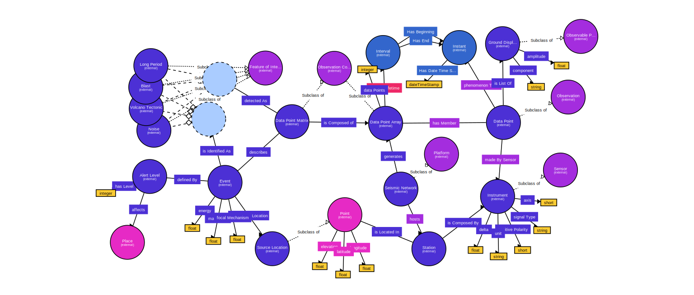

# Volcano Event Ontology (VEO)


## Table of Contents
- [Introduction](#introduction)
- [Features](#features)
- [Imported Ontologies](#imported-ontologies)
- [Contributing](#contributing)

## Introduction

The Volcano Event Ontology (VEO) is a comprehensive semantic model designed to represent seismic and volcanic events, their measurements, geographic locations, and temporal details. Built on established standards like SOSA, GEO, and TIME, VEO facilitates consistent data integration and interoperability across various domains involved in seismic monitoring, research, and disaster management. This repository serves as a central hub for the ontology's documentation, usage examples, and contributions, aiming to support researchers, developers, and organizations in leveraging semantic technologies for more efficient data management and analysis in the field of volcanology.

<p align="center">
  
</p>


## Features

The Volcano Event Ontology (VEO) is designed to model seismic events, their measurements, and the geographic and temporal context surrounding them. It provides a structured framework for representing complex relationships between seismic data, sensor networks, and the associated geospatial and temporal metadata. VEO is particularly useful for volcanic monitoring systems, research in seismology, and emergency response frameworks.

- **Comprehensive Event Representation**: Models various seismic event types, including volcano-tectonic earthquakes, long-period events, blasts, and noise.
- **Seismic Network Integration**: Supports the representation of seismic networks, stations, and individual instruments with detailed sensor metadata.
- **Geospatial and Temporal Context**: Integrates geospatial (latitude, longitude, elevation) and temporal (time instants and intervals) data, enhancing event traceability.
- **Alert Levels and Impact Assessment**: Includes a framework for defining alert levels and linking them to potential impacts on geographical locations.
- **Interoperability**: Built using widely adopted ontological standards, ensuring seamless integration with existing data models and applications.

### Use Cases
- **Real-time Event Monitoring**: Use VEO to feed real-time seismic data into monitoring systems.
- **Historical Data Analysis**: Analyze past events for pattern recognition and risk prediction.
- **Geospatial Mapping**: Visualize seismic events on geographical information systems (GIS) using the spatial data model.


## Imported Ontologies

The VEO ontology incorporates and extends concepts from several well-established ontologies:

- **[WGS84 Geo Positioning (geo)](http://www.w3.org/2003/01/geo/wgs84_pos#)**: Supports geospatial data representation.
- **[OWL Time (time)](http://www.w3.org/2006/time#)**: Enables temporal modeling for events and observations.
- **[Semantic Sensor Network (sosa)](http://www.w3.org/ns/sosa/)**: Used for modeling sensors, observations, and features of interest.

## Citations 

If this work is with your interest, you can read the associated [paper](https://ieeexplore.ieee.org/document/9702529/), and if you use it in your research, please don't forget to cite 👍 this work; the suggested citation in BibTex format is:

``` BibTex
@article{Rincon2022a,
    author = {Mariarosaria Falanga and Enza De Lauro and Simona Petrosino and Diego Rincon-Yanez and Sabrina Senatore},
    doi = {10.1109/JIOT.2022.3148786},
    issn = {23274662},
    issue = {12},
    journal = {IEEE Internet of Things Journal},
    month = {6},
    pages = {9789-9803},
    title = {Semantically Enhanced IoT-Oriented Seismic Event Detection: An Application to Colima and Vesuvius Volcanoes},
    volume = {9},
    year = {2022},
}

```
## Contributing
Contributions to VEO are welcome! Whether it's reporting issues, suggesting enhancements, or submitting pull requests, your feedback helps improve the ontology. Please [follow](CONTRIBUTING.md) steps when contributing


## Troubleshooting

If there are any troubles or you have any questions, please open an issue stating the encountered problem. Contributing is always welcome. The [Github repository Issues URL](https://github.com/d1egoprog/KG-SLR4LLM/issues).  And contributing is always welcome. The [Github repository URL](https://github.com/d1egoprog/KG-SLR4LLM).


Happy hacking!! 🖖🖖.
